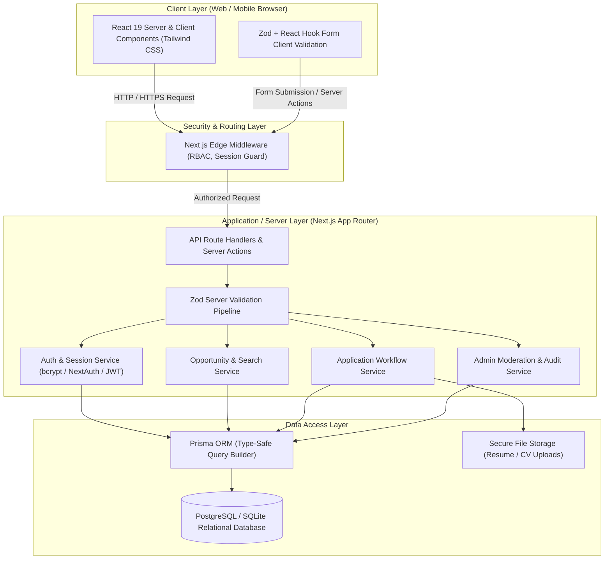

# Phase 2: System Architecture & Design
## Project: CareerBridge Ghana – Student Internship & Career Platform

---

### 1. System Architecture Overview

CareerBridge Ghana follows a **Modern Modular Monolith** architecture built on **Next.js (App Router)** with **TypeScript**, utilizing a layered separation of concerns (Presentation $\rightarrow$ Business/Service Layer $\rightarrow$ Data Access Layer $\rightarrow$ Relational Database).



---

### 2. Technology Stack Selection & Justification

| Layer | Technology | Decision Justification |
| :--- | :--- | :--- |
| **Full-Stack Framework** | **Next.js (App Router, React 19, TypeScript)** | Provides a unified, type-safe full-stack environment. Server Components minimize JavaScript sent to clients (critical for Ghanaian mobile data bandwidth), while Server Actions and Route Handlers provide clean backend abstractions. |
| **Language** | **TypeScript (Strict Mode)** | Enforces end-to-end type safety from the database schema to the UI components, drastically reducing runtime bugs and easing code reviews. |
| **Styling & UI** | **Tailwind CSS + Lucide Icons** | Highly performant utility-first styling with zero runtime overhead. Allows building accessible, mobile-first responsive interfaces quickly without writing bulky custom CSS. |
| **Database & ORM** | **PostgreSQL + Prisma ORM** | Relational integrity (Foreign keys, cascade behaviors, indexing) is mandatory for job applications and user roles. Prisma provides auto-generated type safety and declarative schema migrations. |
| **Authentication** | **NextAuth.js / JWT Session with HTTP-Only Cookies** | Industry-standard session management. Encrypted HTTP-only cookies prevent XSS credential theft. Clean RBAC checks at the middleware and service levels. |
| **Validation** | **Zod** | Shared schemas between client forms and server endpoints ensure zero discrepancy in validation rules. |
| **File Handling** | **Multipart upload with strict MIME & magic-byte validation** | Ensures only valid PDF documents $\le 5\text{MB}$ are accepted and stored safely. |

---

### 3. Frontend Architecture

The frontend is structured around Next.js App Router conventions:
* **Server Components (RSC) by Default:** Public listings, job details, and initial dashboard data are fetched on the server for speed and SEO.
* **Client Components (`use client`):** Isolated strictly to interactive elements (search filter inputs, application form modals, interactive status dropdowns, tab switchers).
* **State Management:** URL search parameters (for sharable filter state), React Hook Form (for complex form validation), and optimistic UI updates for instant feedback.
* **Component Directory Hierarchy:**
  ```text
  src/
  ├── components/
  │   ├── ui/           # Reusable base UI (Button, Input, Badge, Card, Modal, Dropdown)
  │   ├── layout/       # Navbar, Footer, Sidebar, Role-based Dashboard Shells
  │   ├── jobs/         # JobCard, JobFilters, JobDetails, JobPostForm
  │   ├── applications/ # ApplicationCard, StatusBadge, ApplicationTimeline
  │   └── profile/      # StudentProfileForm, EmployerProfileForm, ResumeViewer
  ```

---

### 4. Backend Architecture & Service Layer

To adhere to clean architecture and avoid fat controllers/route handlers:

```text
src/
├── app/api/            # Thin REST / Route Handlers (HTTP Request -> Service -> JSON Response)
├── lib/
│   ├── auth/           # Session helpers, password hashing, token validation
│   ├── db/             # Prisma client singleton instance
│   ├── services/       # Core Business Logic
│   │   ├── auth.service.ts
│   │   ├── job.service.ts
│   │   ├── application.service.ts
│   │   └── admin.service.ts
│   ├── validations/    # Zod schemas (jobSchema, userSchema, applicationSchema)
│   └── errors/         # Custom AppError classes (NotFoundError, UnauthorizedError, etc.)
```

#### Standardized API Response Contract
All endpoints adhere to a predictable envelope format:
```typescript
interface ApiResponse<T> {
  success: boolean;
  data?: T;
  error?: {
    code: string;
    message: string;
    details?: unknown;
  };
  meta?: {
    page?: number;
    limit?: number;
    total?: number;
  };
}
```

---

### 5. Authentication & Role-Based Access Control (RBAC)

#### User Roles:
1. `STUDENT` — Browse, save, and apply to opportunities; manage profile and resume.
2. `EMPLOYER` — Create company profile, post & manage opportunities, view and update candidate applications.
3. `ADMIN` — Verify employer profiles, approve/flag job postings, access system metrics and audit logs.

#### Security Flow:
1. **Login:** User submits credentials $\rightarrow$ Password verified via `bcrypt` against hashed record in database $\rightarrow$ Signed JWT session issued inside an `HttpOnly`, `SameSite=Lax`, `Secure` cookie.
2. **Request Interception:** Next.js Edge Middleware checks routes starting with `/dashboard/*`, `/employer/*`, `/admin/*`. Unauthenticated or unauthorized users are redirected with appropriate status codes (401 / 403).
3. **Defense-in-Depth:** In addition to route middleware, backend service methods explicitly assert the caller's `userId` and `role` before executing database mutations (e.g., ensuring an employer can only edit their own listings).

---

### 6. Security Considerations & Defenses

* **Injection Prevention:** Prisma ORM utilizes parameterized SQL queries by default, mitigating SQL injection risks.
* **XSS Mitigation:** React automatically escapes output content; sensitive auth tokens are stored in `HttpOnly` cookies.
* **CSRF Protection:** Next.js Server Actions and custom API route origin checks guard against cross-site request forgery.
* **File Upload Security:** 
  * Validate MIME types against `application/pdf`.
  * Enforce maximum file size ($5\text{ MB}$).
  * Prevent arbitrary file execution by saving uploads with randomized UUID filenames in an isolated folder/bucket.
* **Rate Limiting:** Protect `/api/auth/*` and search endpoints against brute-force and scraping.

---

### 7. Scalability & Performance Strategy

1. **Database Indexing:** Compound indexes on `(status, deadline)` and `(employerId, createdAt)` for rapid dashboard and public listing retrieval.
2. **Pagination:** Cursor/Offset-based pagination on all opportunity lists to prevent large payload transfers.
3. **Data Bandwidth Optimization:** Dynamic image optimization with Next.js Image component and minimal client-side JS bundles to cater to lower-bandwidth Ghanaian mobile networks.
4. **Clean Decoupling:** The service layer pattern makes it easy to split out background jobs (e.g., batch email reminders) into independent worker queues (e.g., BullMQ / Redis) in future scaling phases.
