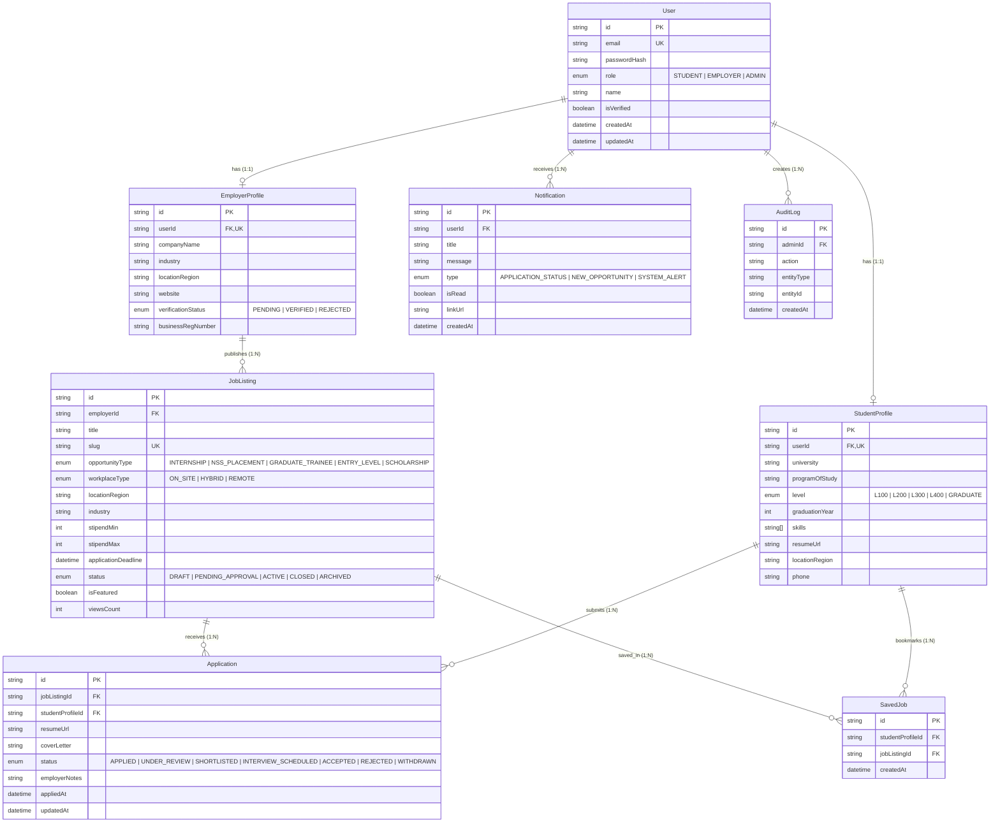

# Phase 3: Database Design & Relational Schema
## Project: CareerBridge Ghana – Student Internship & Career Platform

---

### 1. Entity Identification & Normalization

The database is normalized to Third Normal Form (3NF) to minimize data redundancy and ensure strict referential integrity.

#### Identified Entities:
1. **User:** Core authentication and role entity (`STUDENT`, `EMPLOYER`, `ADMIN`).
2. **StudentProfile:** 1-to-1 extension of `User` for students containing academic and career credentials.
3. **EmployerProfile:** 1-to-1 extension of `User` for verified companies and recruiters in Ghana.
4. **JobListing:** Opportunities posted by employers (Internships, NSS, Graduate Trainees, Entry-Level, Scholarships).
5. **Application:** Represents a student's application to a specific job listing with a trackable status workflow.
6. **SavedJob (Bookmark):** Many-to-Many junction enabling students to save opportunities for future reference.
7. **Notification:** In-app transactional alerts for status updates and announcements.
8. **AuditLog:** Compliance and moderation tracking for administrative actions.

---

### 2. Entity Relationship Diagram (ERD)

---

### 3. Database Indexes & Performance Strategy

To ensure sub-millisecond query performance and seamless filtering:

1. **`JobListing` Compound Index (`status`, `applicationDeadline`):**
   * Speeds up the primary public landing page query: finding all active, unexpired job listings.
2. **`JobListing` Filter Index (`locationRegion`, `opportunityType`, `industry`):**
   * Accelerates faceted search on the discovery catalog.
3. **`Application` Unique Constraint & Index (`studentProfileId`, `jobListingId`):**
   * Enforces database-level prevention of duplicate applications for the same role by the same candidate.
4. **`SavedJob` Unique Constraint (`studentProfileId`, `jobListingId`):**
   * Prevents duplicate bookmarks.
5. **`Notification` Compound Index (`userId`, `isRead`, `createdAt`):**
   * Efficiently renders unread notification badges and paginated user inboxes.

---

### 4. Seed Data Strategy

A comprehensive seed script (`prisma/seed.ts`) will be implemented in Phase 4 containing:
1. **Default Admin User:** `admin@careerbridge.gh` (pre-verified).
2. **Sample Verified Employers:** FinTech, Telecom, AgriTech, and Energy companies in Ghana (e.g., Accra, Kumasi, Takoradi).
3. **Realistic Job Listings:** 10+ categorized opportunities with authentic Ghana requirements (e.g., NSS Tech Placements, Summer Internships at MTN/Vodafone/Hubtel, Ashesi/UG/KNUST graduate trainee cohorts).
4. **Sample Student Profiles:** Diverse academic backgrounds with mock skills and portfolios.
5. **Sample Application Workflows:** Pre-populated applications across all status stages to facilitate instant UI testing.
