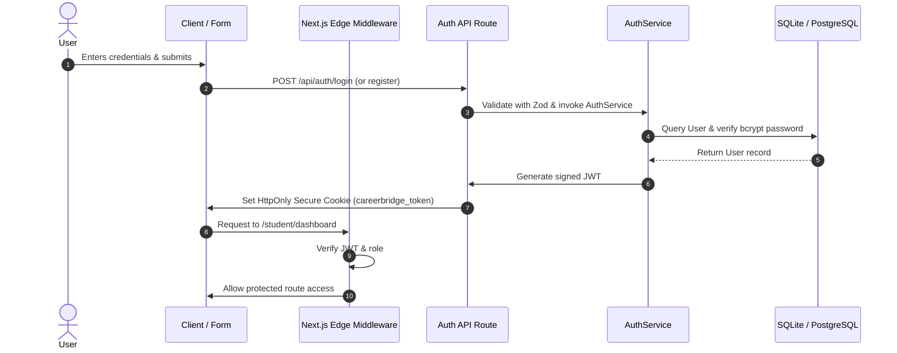

# Phase 5: Authentication & Authorization
## Project: CareerBridge Ghana – Student Internship & Career Platform

---

### 1. Overview & Architecture

Phase 5 establishes user identity management and Role-Based Access Control (RBAC) across the entire application stack.

---

### 2. Key Components Implemented

#### 1. Security & Token Infrastructure
* **Password Hashing:** `bcryptjs` with 10 salt rounds (`src/lib/auth/password.ts`).
* **JWT Session Tokens:** Signed payload containing `userId`, `email`, `role`, and `name` with a 7-day expiration (`src/lib/auth/jwt.ts`).
* **Cookie Protection:** `HttpOnly`, `SameSite=Lax`, `Secure` in production to eliminate XSS token theft.

#### 2. Input Validation (Zod)
* `loginSchema`: Validates email formatting and minimum password length.
* `registerStudentSchema`: Enforces valid Ghanaian institutions (UG, KNUST, UCC, Ashesi, etc.), study levels, and regional selections.
* `registerEmployerSchema`: Validates corporate identities, industry categories, and optional Registrar General numbers.

#### 3. Core Business Services
* `AuthService.registerStudent`: Creates `User` and linked `StudentProfile`.
* `AuthService.registerEmployer`: Creates `User` and linked `EmployerProfile` with `PENDING` verification status.
* `AuthService.login`: Validates credentials, verifies hash, and returns user identity.

#### 4. Endpoints & Route Handlers
* `POST /api/auth/register/student`
* `POST /api/auth/register/employer`
* `POST /api/auth/login`
* `POST /api/auth/logout`
* `GET /api/auth/me`

#### 5. Role-Based Access Control (Middleware)
* `src/middleware.ts`: Guard intercepts `/student/*`, `/employer/*`, `/admin/*`, and `/applications/*` routes, redirecting unauthenticated visitors to `/auth/login`.

#### 6. User Interface Components
* `src/components/layout/Navbar.tsx`: Auto-detects session and renders user details, role badge, and sign-out controls.
* `src/components/auth/LoginForm.tsx`: User login interface with error alerts.
* `src/components/auth/StudentRegisterForm.tsx`: Student onboarding interface.
* `src/components/auth/EmployerRegisterForm.tsx`: Corporate recruiter onboarding interface.
* `src/app/auth/login/page.tsx` & `src/app/auth/register/page.tsx`: Responsive authentication views.
